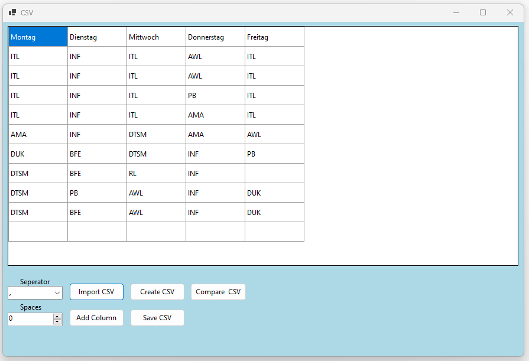
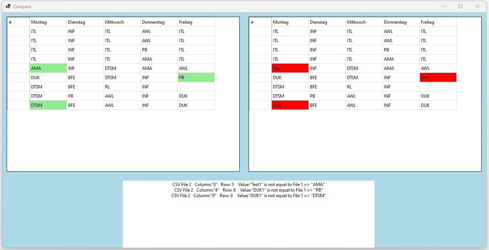

# CSV (Comma-separated values)
A simple CSV application.
- https://de.wikipedia.org/wiki/CSV_(Dateiformat)

## Windows Forms

### Compare CSV files

#
- Git Clone Project
- Build Project
- Start Project
